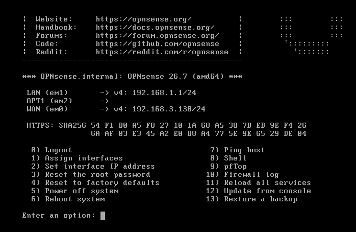
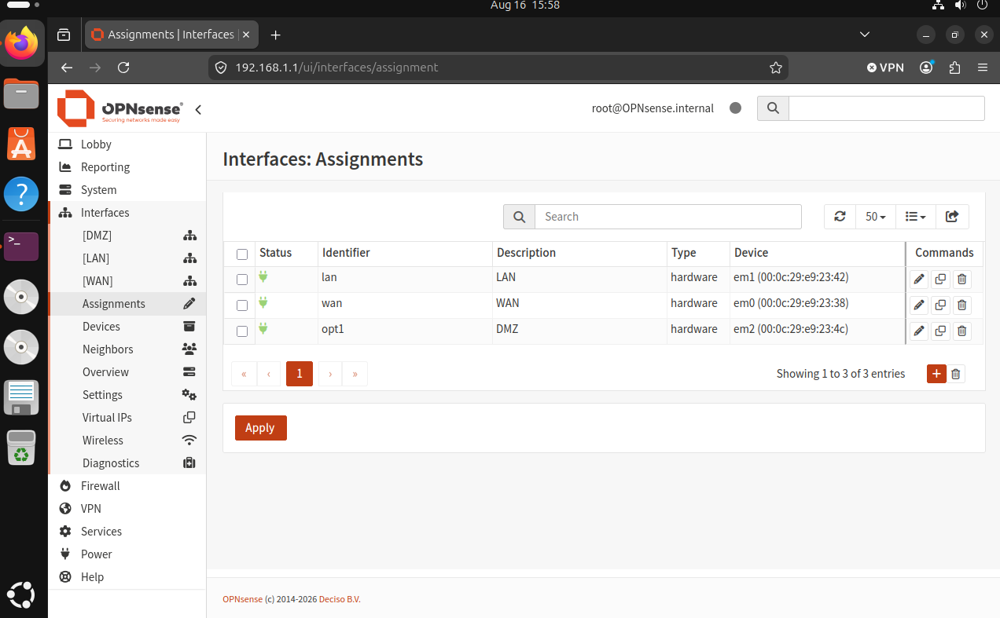
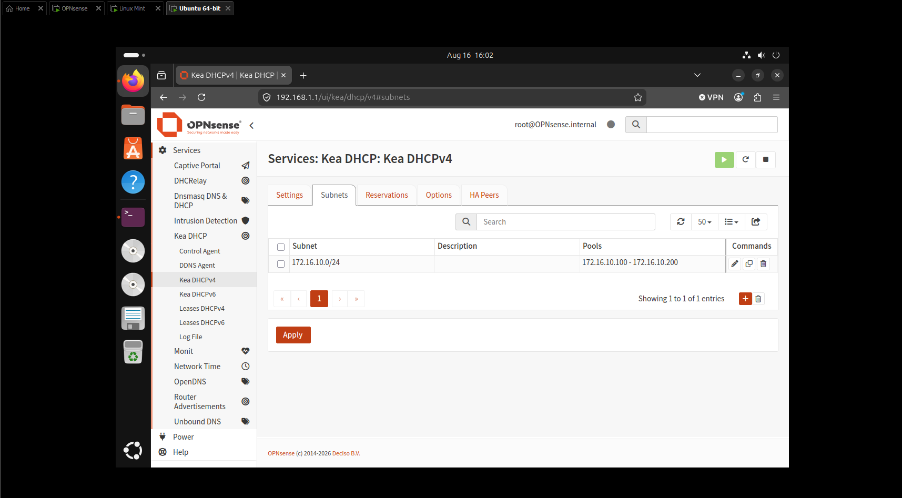
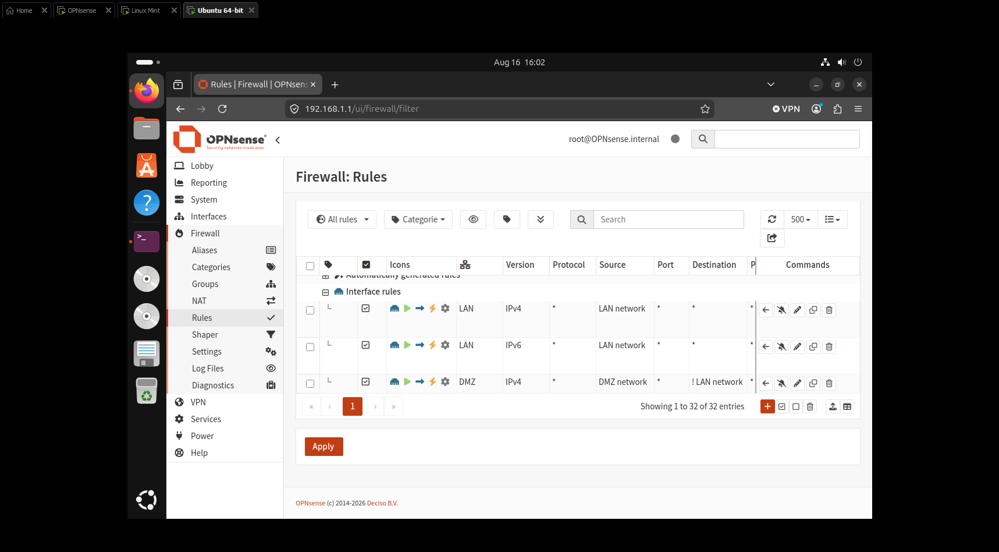
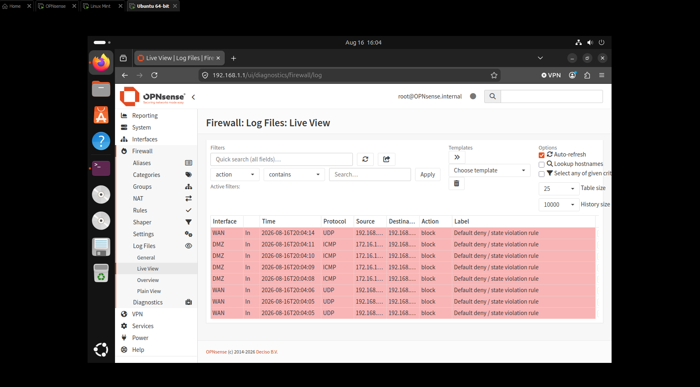
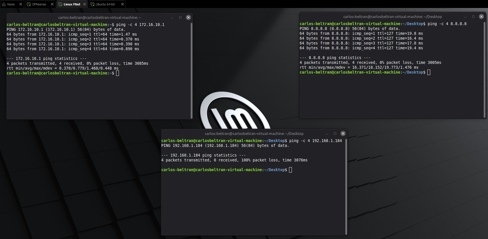
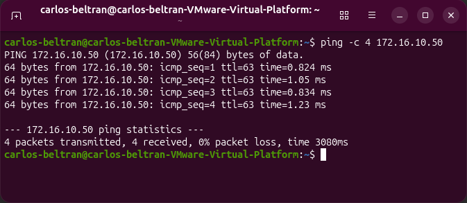

# Enterprise Network Segmentation & DMZ Firewall Lab

## Project Overview
This project demonstrates the architecture, deployment, and security verification of an isolated 3-tier virtual enterprise network. Built using **OPNsense Firewall**, **Ubuntu Desktop (Internal LAN)**, and **Linux Mint (DMZ Server)** within **VMware Workstation**, this lab implements stateful packet filtering, automated DHCP provisioning via Kea DHCP, zone routing, and Zero Trust micro-segmentation principles.

The primary objective is to enforce boundary isolation: allowing external services in the DMZ to access the Internet while preventing lateral movement into the secure internal network.

---

## Network Architecture & Addressing

| Zone | Interface | Segment Type | IP / Subnet | DHCP Scope | Function / Purpose |
| :--- | :--- | :--- | :--- | :--- | :--- |
| **WAN** | `em0` | Bridged / NAT | DHCP (Upstream) | Upstream Gateway | External Internet Connectivity |
| **LAN** | `em1` | VMware LAN Segment | `192.168.1.1/24` | `192.168.1.100 - 192.168.1.200` | Secure Internal Management Subnet |
| **DMZ** | `em2` | VMware LAN Segment | `172.16.10.1/24` | `172.16.10.100 - 172.16.10.200` | Isolated Public-Facing Server Subnet |

---

## Technical Implementation & Visual Walkthrough

### 1. Virtual Network Topology & Architecture

* **Context:** The initial boot console of the OPNsense firewall instance running in VMware Workstation.
* **Technical Breakdown:**
  * Displays the core interface bindings: `em0` assigned to WAN (`192.168.3.130/24`), `em1` bound to LAN (`192.168.1.1/24`), and `em2` designated for the DMZ boundary.
  * Proves the Layer 2 hardware binding across separate virtual switches (LAN segments) prior to web management configuration.

---

### 2. OPNsense Interface Assignments

* **Context:** The **Interfaces: Assignments** configuration panel in the OPNsense Web GUI.
* **Technical Breakdown:**
  * Maps physical device adapters (`em0`, `em1`, `em2`) to logical firewall zones (`WAN`, `LAN`, `DMZ`).
  * Shows all three network interfaces in an active (green plug) link-state status, enabling zone-based firewall rules to be applied independently per interface.

---

### 3. Kea DHCP Subnet Provisioning

* **Context:** Modern **Kea DHCPv4** service configuration providing dynamic IP allocation to the DMZ.
* **Technical Breakdown:**
  * Defines the `172.16.10.0/24` subnet with an active dynamic leasing pool spanning `172.16.10.100` to `172.16.10.200`.
  * Ensures that newly deployed public-facing servers or services in the DMZ receive correct gateway (`172.16.10.1`) and DNS parameters automatically without manual static assignment.

---

### 4. DMZ Access Control Policy & Rule Inversion

* **Context:** The active firewall filtering table under **Firewall > Rules > DMZ**.
* **Technical Breakdown:**
  * Implements an **Inverted Destination Rule**: `Pass` traffic where `Source = DMZ network` and `Destination = ! LAN network` (NOT LAN network).
  * This single stateful rule allows DMZ nodes to communicate with the outside Internet and resolve DNS while implicitly blocking any connection attempts targeting the internal private LAN (`192.168.1.0/24`).

---

### 5. Real-Time Security Log Analysis

* **Context:** The OPNsense **Live View** log stream capturing firewall state inspection in real-time.
* **Technical Breakdown:**
  * Highlights red `block` entries triggered by the `Default deny / state violation rule`.
  * Demonstrates the firewall actively dropping ICMP packets originating from `172.16.10.x` attempting to access host `192.168.1.184` on the LAN.

---

### 6. DMZ Host Verification & Boundary Testing

* **Context:** Multi-terminal testing executed from the DMZ workstation (**Linux Mint**).
* **Technical Breakdown:**
  * **Gateway Reachability (`172.16.10.1`):** `0% packet loss` — Confirms local Layer 3 gateway routing is functioning.
  * **Outbound Internet (`8.8.8.8`):** `0% packet loss` — Confirms outbound NAT masquerading and external WAN access work.
  * **LAN Isolation Test (`192.168.1.184`):** `100% packet loss` — Confirms that lateral movement into the internal corporate LAN is strictly blocked.

---

### 7. LAN Administrative Management Access

* **Context:** Administrative verification executed from the internal LAN workstation (**Ubuntu**).
* **Technical Breakdown:**
  * Pinging DMZ Host (`172.16.10.50`): `0% packet loss` with sub-millisecond latency.
  * Demonstrates asymmetric firewall permissions: internal LAN operators retain management reachability into the DMZ, while the DMZ cannot initiate traffic back into the LAN.

---

## Core Skills Demonstrated
* **Enterprise Firewall Engineering:** Deployment, interface assignment, and rule tuning in OPNsense.
* **Network Segmentation & Zero Trust:** Designing DMZ boundaries to prevent lateral network pivoting.
* **Infrastructure Services:** Configuring Kea DHCPv4 scopes and pools across multiple network segments.
* **Packet Inspection & Verification:** Using ICMP probing and live firewall log analysis to validate security policies.
* **Virtualization Architecture:** Configuring custom virtual network adapters and isolated LAN segments in VMware Workstation.
