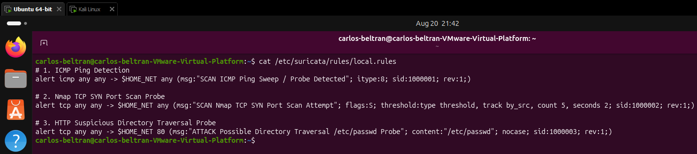
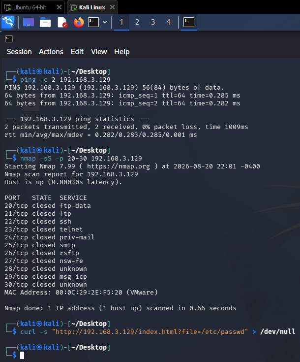
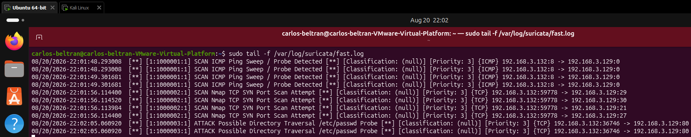
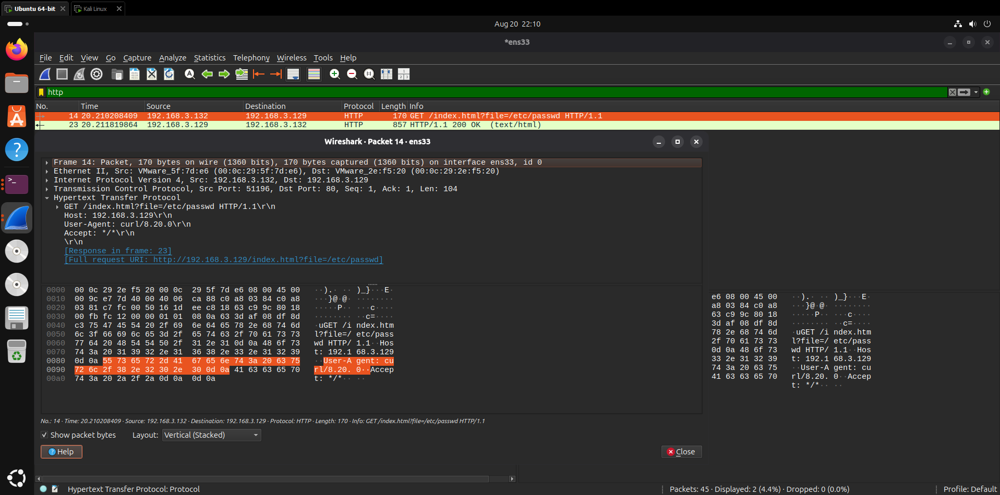

# Network Intrusion Detection System (NIDS) & Deep Packet Inspection Lab

## Project Overview
This project demonstrates the architecture, deployment, and validation of an enterprise-grade Network Intrusion Detection System (NIDS) using **Suricata 8.0** and **Wireshark** on Linux.

The primary objective is to engineer signature-based detection mechanisms capable of identifying multi-stage cyber attack workflows in real time. Operating within a segmented VMware test environment, custom detection rules were authored to catch passive discovery sweeps, active TCP SYN port scans, and Layer 7 web application directory traversal exploit attempts generated from an external Kali Linux attack station.

---

## Network Architecture & Addressing

| Node | Role | OS / Platform | Interface | IP / Subnet | Function / Purpose |
| :--- | :--- | :--- | :--- | :--- | :--- |
| **Defensive Sensor** | NIDS & Packet Analyzer | Ubuntu Desktop 64-bit | `ens33` | `192.168.3.129/24` | Real-time traffic inspection, Suricata engine, and PCAP analysis |
| **Adversary Node** | Threat Generator / Attacker | Kali Linux | `eth0` | `192.168.3.132/24` | Reconnaissance, scanning, and payload injection source |
| **Target Service** | Web Application Tier | Apache HTTP Server | `ens33:80` | `192.168.3.129:80` | Monitored HTTP endpoint receiving web requests |
| **Virtual Switch** | Virtual Hypervisor Subnet | VMware Workstation Pro | `VMnet8` | `192.168.3.0/24` | Layer 2/3 virtual switching and NAT routing environment |

---

## Technical Implementation & Visual Walkthrough

### 1. Custom Suricata Signature Engineering

* **Context:** Authoring tailored detection rules in `/etc/suricata/rules/local.rules` to detect reconnaissance, scanning, and application exploitation.
* **Technical Breakdown:**
  * **SID 1000001 (ICMP Detection):** `alert icmp any any -> $HOME_NET any (msg:"SCAN ICMP Ping Sweep / Probe Detected"; itype:8; sid:1000001; rev:1;)` monitors incoming ICMP Echo Requests (`itype:8`) targeting the protected internal subnet.
  * **SID 1000002 (SYN Scan Detection):** `alert tcp any any -> $HOME_NET any (msg:"SCAN Nmap TCP SYN Port Scan Attempt"; flags:S; threshold:type threshold, track by_src, count 5, seconds 2; sid:1000002; rev:1;)` triggers when more than 5 TCP SYN packets are received from a single source within a 2-second sliding window, suppressing false alarms from standard single-port connections.
  * **SID 1000003 (Directory Traversal Attack):** `alert tcp any any -> $HOME_NET 80 (msg:"ATTACK Possible Directory Traversal /etc/passwd Probe"; content:"/etc/passwd"; nocase; sid:1000003; rev:1;)` performs deep packet inspection across HTTP traffic destined for port 80, flagging case-insensitive string matches for `/etc/passwd`.

---

### 2. Adversary Threat Generation (Kali Linux)

* **Context:** Executing synthetic adversary activity from Kali Linux (`192.168.3.132`) against the target host (`192.168.3.129`).
* **Technical Breakdown:**
  * **ICMP Echo Probe:** `ping -c 2 192.168.3.129` verifies host reachability and generates baseline discovery traffic.
  * **Stealth TCP SYN Scan:** `nmap -sS -p 20-30 192.168.3.129` sends uncompleted TCP handshake packets across ports 20 through 30, confirming port 80 is open while tripping the threshold rule.
  * **Web Exploit Simulation:** `curl -s "http://192.168.3.129/index.html?file=/etc/passwd" > /dev/null` executes an HTTP GET request containing an arbitrary file read payload against the Apache web server.

---

### 3. Real-Time NIDS Alert Generation & Logging

* **Context:** Suricata monitoring active interface `ens33` in live passive capture mode, appending evaluated alert signatures to `/var/log/suricata/fast.log`.
* **Technical Breakdown:**
  * **Echo Request Tripped:** Suricata captured incoming ICMP Echo Requests from `192.168.3.132` and classified them under SID `1000001`.
  * **Scan Threshold Exceeded:** Rapid SYN frames across ports 20–30 exceeded the 5-packet limit, generating alert entries for SID `1000002`.
  * **Application Exploit Matched:** Deep packet inspection of the incoming stream on port 80 detected the `/etc/passwd` payload string, logging alert SID `1000003` with source port `54354` and destination port `80`.

---

### 4. Deep Packet Inspection & Dissection (Wireshark)

* **Context:** Dissecting the raw packet stream in Wireshark to perform forensic verification of the exploit payload identified by Suricata.
* **Technical Breakdown:**
  * **Protocol Filtering:** Applied display filter `http` to isolate Layer 7 HTTP conversations on interface `ens33`.
  * **Frame & Transport Headers:** Frame 11 validates source `192.168.3.132:38028` communicating over TCP to `192.168.3.129:80`.
  * **ASCII/Hex Payload Confirmation:** Byte offset `0x0040` highlights the exact malicious payload string: `GET /index.html?file=/etc/passwd HTTP/1.1`, confirming positive signature correlation with zero packet loss.

---

## Security Takeaways & Hardening Strategies

* **Threshold Tuning Against Alert Fatigue:** High-volume port scans can quickly flood security logging infrastructure. Utilizing `threshold:type threshold` with time-based intervals ensures meaningful alert generation without exhausting SIEM capacity.
* **Payload-Aware Defense (L7 vs L4):** Traditional packet-filtering firewalls evaluate source, destination, and ports. NIDS signatures with deep packet inspection capabilities (`content:` modifiers) are critical to detecting application-layer attacks concealed within legitimate open service ports.
* **Alert & PCAP Correlation:** Pairing rapid alert summaries (`fast.log`) with raw packet capture files (`.pcap`) accelerates incident triage, enabling SOC analysts to differentiate between harmless scanning and true positive exploitation.

---

## Repository Structure
