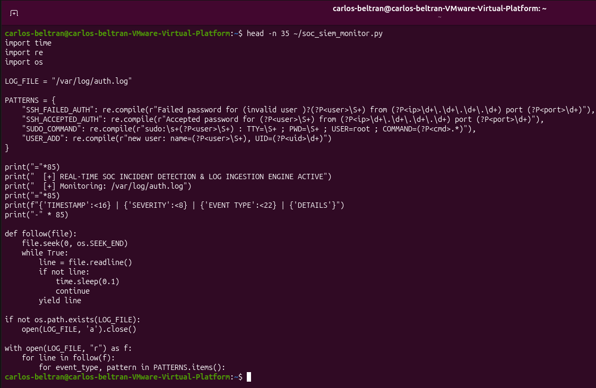
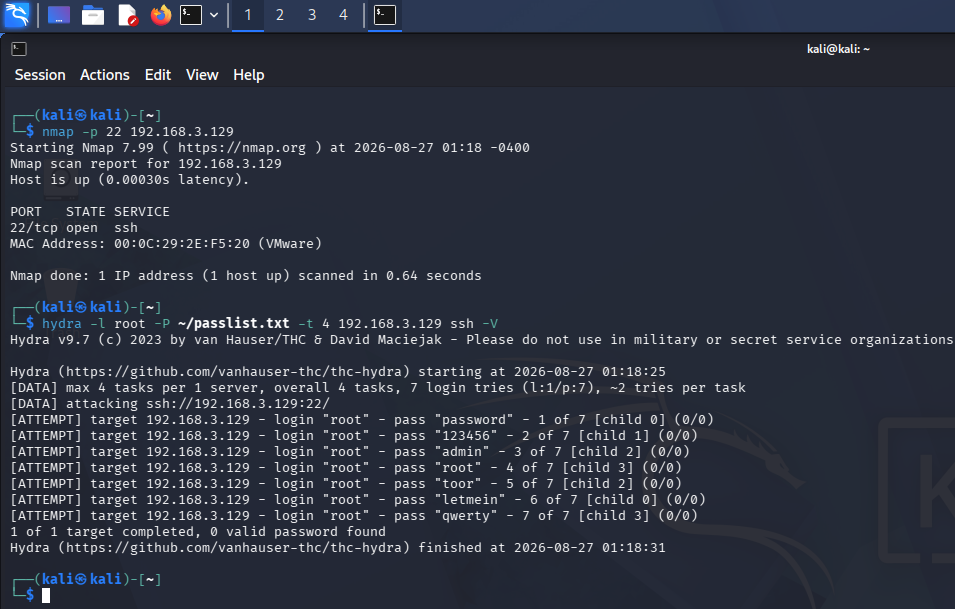
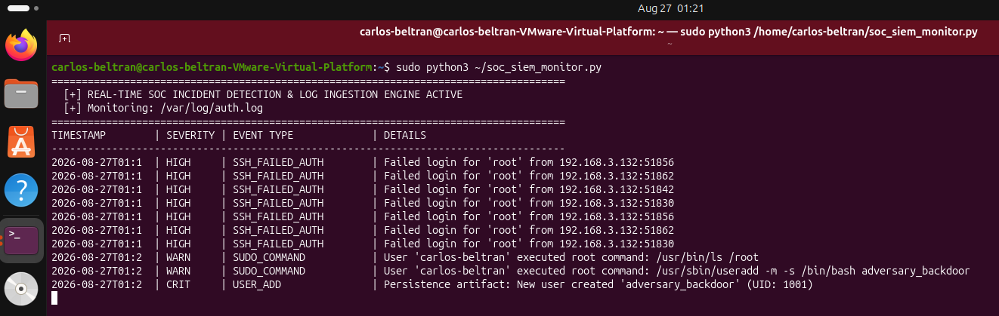
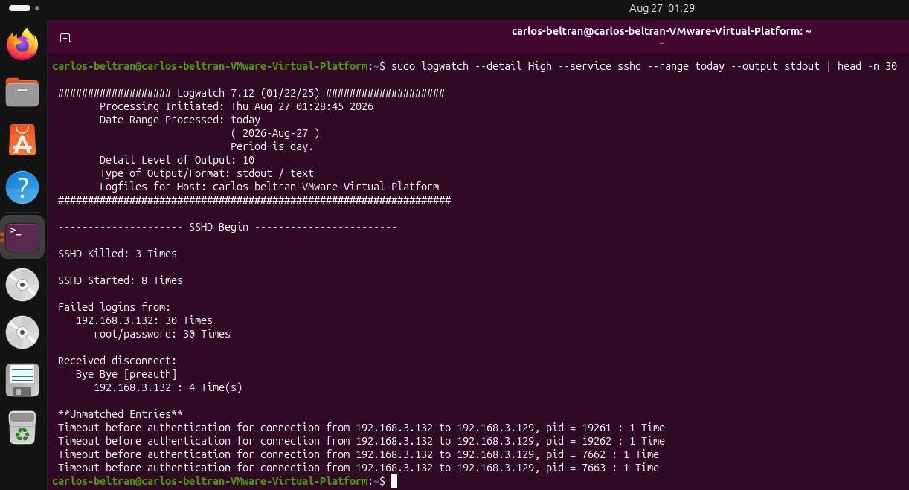

## Network Architecture & Node Addressing

| Node | Role | OS / Platform | Interface | IP / Subnet | Function / Purpose |
| :--- | :--- | :--- | :--- | :--- | :--- |
| **Monitored Endpoint** | Target System & SIEM Engine | Ubuntu Desktop 64-bit | `ens33` | `192.168.3.129/24` | Ingestion pipeline, auth logging, and telemetry parsing |
| **Adversary Station** | Attack Source / Threat Actor | Kali Linux | `eth0` | `192.168.3.132/24` | Network discovery, automated credential brute-forcing |
| **Logging Daemon** | System Telemetry Pipeline | Rsyslog / OpenSSH | Local | Host-Level | Generates standard authorization events to `/var/log/auth.log` |
| **Virtual Switch** | Virtual Hypervisor Subnet | VMware Workstation Pro | `VMnet8` | `192.168.3.0/24` | Isolated Layer 2/3 virtual network segment |

---

## Technical Implementation & Visual Walkthrough

### 1. SIEM Ingestion Engine & Pattern Architecture

* **Context:** Authoring a non-blocking log tailing and regex parsing daemon (`soc_siem_monitor.py`) designed to ingest authentication streams directly from `/var/log/auth.log`.
* **Technical Breakdown:**
  * **Regex Extraction:** Pre-compiled patterns extract named fields (`user`, `ip`, `port`, `cmd`, `uid`) from raw syslog records.
  * **Event Classification:** Maps authentication anomalies, privilege escalation commands (`sudo`), and account provisioning artifacts into distinct event categories (`SSH_FAILED_AUTH`, `SUDO_COMMAND`, `USER_ADD`).
  * **Severity Assignment:** Assigns standardized SOC severity ratings (`HIGH`, `WARN`, `CRIT`, `INFO`) based on risk impact.

---

### 2. Adversary Threat Execution (Kali Linux)

* **Context:** Executing synthetic adversary activity from Kali Linux (`192.168.3.132`) against the target host (`192.168.3.129`).
* **Technical Breakdown:**
  * **Port Discovery (T1046):** `nmap -p 22 192.168.3.129` verifies OpenSSH port state and host availability.
  * **Password Guessing / Brute-Force (T1110.001):** `hydra -l root -P ~/passlist.txt -t 4 192.168.3.129 ssh -V` rapidly submits unauthenticated credential pairs against the SSH daemon to simulate an automated dictionary attack.

---

### 3. Real-Time SOC Incident Ingestion & Detection Feed

* **Context:** Active telemetry dashboard ingesting and formatting events live as the adversary executes attacks against the system.
* **Technical Breakdown:**
  * **Credential Access Tripped (HIGH):** Rapid `SSH_FAILED_AUTH` events correlate consecutive failed login attempts targeting account `root` from source IP `192.168.3.132`.
  * **Privilege Abuse Monitored (WARN):** Detects execution of privileged commands via `sudo /usr/bin/ls /root` and `sudo /usr/sbin/useradd`.
  * **Persistence Artifact Identified (CRIT):** Flags creation of unauthorized local user `adversary_backdoor` (UID: `1001`), exposing an adversary persistence mechanism immediately upon execution.

---

### 4. Central Audit Aggregation & Logwatch Telemetry Summary

* **Context:** Generating an aggregated audit report via Logwatch to validate total attack volume and evaluate persistence indicators across system services.
* **Technical Breakdown:**
  * **Anomaly Quantification:** Aggregates and confirms 30 failed SSH authentication attempts originating exclusively from the adversary node `192.168.3.132`.
  * **Service Health & Audit:** Quantifies total daemon restarts, socket timeouts, and unauthenticated disconnects for forensic reporting and baseline verification.

---

## Security Takeaways & Hardening Strategies

* **Centralized Telemetry Correlation:** Host-based event monitoring bridges the gap between network perimeter alerts and host-level actions. Even if network traffic is encrypted (e.g., SSH, TLS), host logging maintains full visibility into executed commands and account mutations.
* **Automated Threat Detection:** Manual log inspection fails during high-velocity attacks. Continuous parsing pipelines with structured severity scoring allow SOC analysts to instantly isolate critical indicators of compromise (IOCs) from routine background noise.
* **Defense-in-Depth Pipeline:** Combining firewall boundary controls (Lab 1) and NIDS packet inspection (Lab 2) with endpoint SIEM telemetry (Lab 3) provides end-to-end detection across the entire cyber kill chain.
